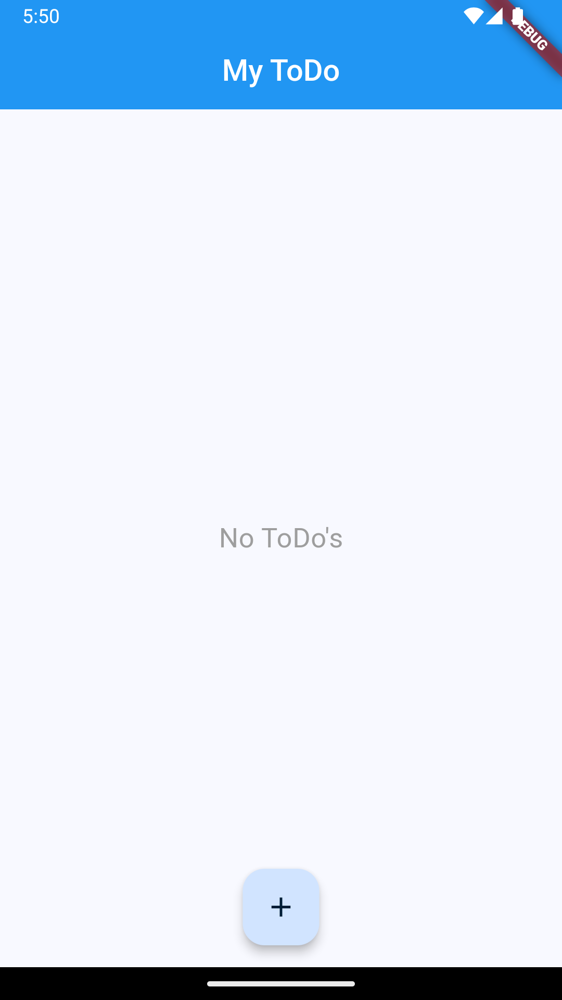
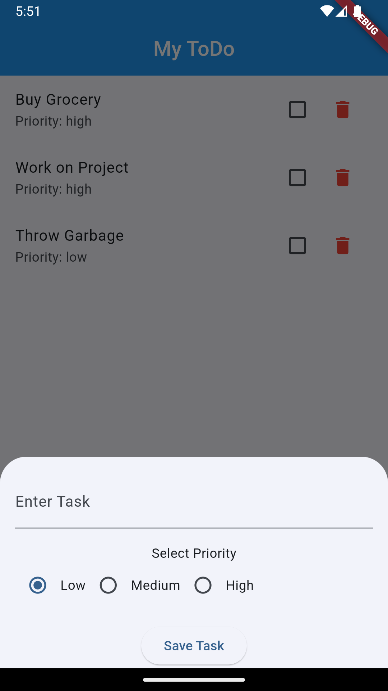

# My ToDo App

A simple ToDo application built with Flutter. This app allows users to add, view, and delete tasks with different priority levels.

## Features

- **Add Tasks:** Users can add new tasks with a name and priority.
- **View Tasks:** Displays a list of tasks with their names and priorities.
- **Delete Tasks:** Users can delete tasks from the list.
- **Task Priority:** Supports three priority levels: Low, Medium, and High.
- **Real-time Updates:** Tasks are updated in real-time without needing to refresh the screen.

## Screenshots

  
*Home Screen*

  
*Add Task Screen*

## Installation

### Prerequisites

- [Flutter](https://flutter.dev/docs/get-started/install) - Flutter SDK installed on your machine.
- [Dart](https://dart.dev/get-dart) - Dart programming language.

### Clone the Repository

```bash
git clone https://github.com/yourusername/my_todo_app.git
cd my_todo_app
```

### Install Dependencies

```bash
flutter pub get
```

### Run the App

```bash
flutter run
```

## How It Works

1. **Main Application (`main.dart`):** Initializes the Flutter app and sets up the main screen (`TodoListScreen`).
2. **TodoListScreen:** Displays the list of tasks and provides a floating action button to add new tasks.
3. **Task Addition:** Opens a bottom sheet with a text input and priority selection to create a new task.
4. **Task Deletion:** Each task in the list has a delete button to remove it from the list.

## Code Structure

- `main.dart`: Entry point of the application. Sets up the `MaterialApp` and initial route.
- `my_todo.dart`: Contains the `MyTodo` class for managing tasks and their properties.

## Contributing

Contributions are welcome! Please follow these steps to contribute:

1. Fork the repository.
2. Create a new branch (`git checkout -b feature/your-feature`).
3. Make your changes.
4. Commit your changes (`git commit -am 'Add new feature'`).
5. Push to the branch (`git push origin feature/your-feature`).
6. Create a new Pull Request.

## License

This project is licensed under the MIT License - see the [LICENSE](LICENSE) file for details.

## Contact

For any questions or feedback, please reach out to [your.email@example.com](mailto:your.email@example.com).

---

Replace `https://github.com/yourusername/my_todo_app.git` with the actual URL of your GitHub repository and `your.email@example.com` with your actual email address. Additionally, you can add actual screenshots to the `assets/screenshots` directory if you have them.
